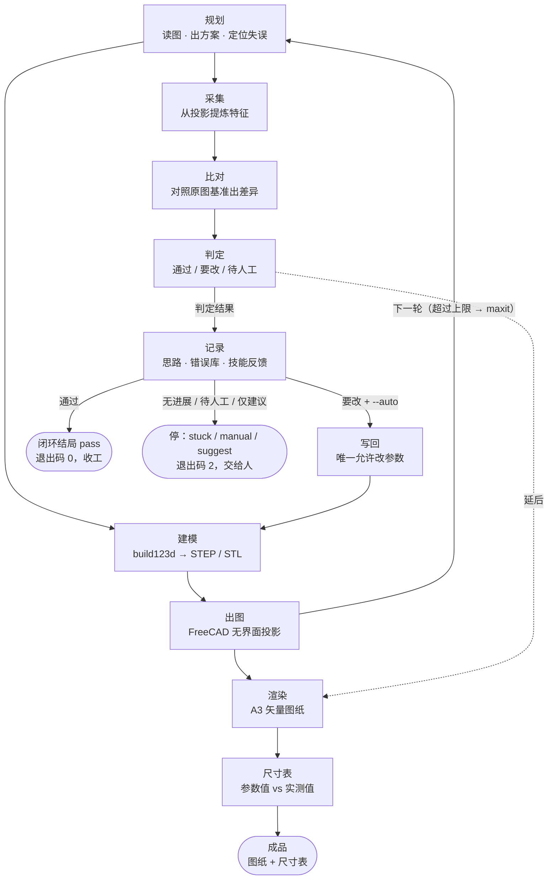

# 流程图（自动生成，勿手改）

> 本文件由 `tools/gen_flowchart.py` 从 `pipe.py` 的 `STEPS` 生成，**不要手改**。
> 改了流水线拓扑后跑：`python tools/gen_flowchart.py`



---

## 步骤清单与运行参数

```
步骤清单（来自 pipe.py 的 STEPS，共 10 步）
----------------------------------------------------
s0_plan      规划     读图 · 出方案 · 定位失误                每轮开头
s1_build     建模     build123d → STEP / STL         
s2_drawing   出图     FreeCAD 无界面投影                  
s3_render    渲染     A3 矢量图纸                        延迟出图
s4_table     尺寸表    参数值 vs 实测值                     延迟出图
s5_collect   采集     从投影提炼特征                        仅 --loop
s6_compare   比对     对照原图基准出差异                      仅 --loop
s7_decide    判定     通过 / 要改 / 待人工                  仅 --loop
s8_apply     写回     唯一允许改参数                        仅 --loop/按需
s9_record    记录     思路 · 错误库 · 技能反馈                每轮结尾/仅 --loop

主链（每次都跑）: s0_plan → s1_build → s2_drawing → s3_render → s4_table
闭环（--loop）  : 规划 → s5_collect → s6_compare → s7_decide → 记录
延迟出图        : s3_render / s4_table
迭代时只重跑    : s1_build → s2_drawing
轮次上限        : 默认 6（--max=N 可调）
```
